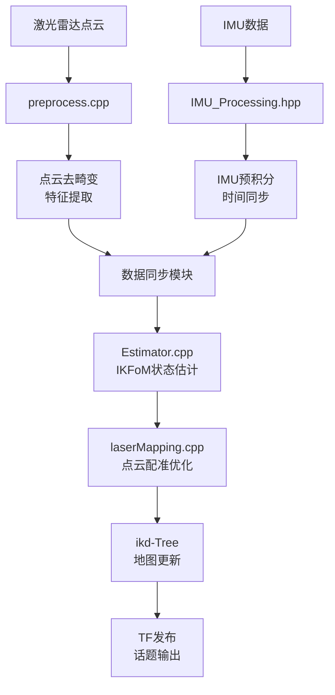

# Point-LIO ROS2 激光雷达SLAM定位系统

**ROBOCON 2025 投篮车激光雷达+IMU融合定位模块**

基于 **Point-LIO (Point cloud and IMU based LiDAR-Inertial Odometry)** 算法的高精度实时SLAM定位系统，专为ROBOCON 2025"飞身上篮"项目设计，支持宇树雷达L2等多种激光雷达硬件。

## 🎯 核心特性

- **高精度融合定位**: 激光雷达点云 + IMU惯性数据紧耦合融合
- **实时性能**: 基于ikd-Tree动态KD树的高效地图管理，支持实时建图与定位
- **鲁棒算法**: 采用IKFoM(迭代扩展卡尔曼滤波)进行状态估计，抗干扰能力强
- **多硬件支持**: 兼容宇树雷达L2、Velodyne、Ouster、Hesai等多种激光雷达
- **双工作模式**: 支持SLAM建图模式和纯定位模式

## 🏗️ 系统架构

### 技术栈
- **算法核心**: Point-LIO算法，基于直接点云配准的激光雷达惯性里程计
- **状态估计**: IKFoM迭代扩展卡尔曼滤波器
- **地图管理**: ikd-Tree动态KD树，支持增量式地图更新
- **数据处理**: 多线程点云预处理，运动畸变补偿
- **框架**: ROS2 Humble，C++17

### 文件结构
```plaintext
Lidar_Pointlio/
├── src/                           # 核心源代码
│   ├── laserMapping.cpp           # SLAM主程序 (1323行)
│   │   ├── 点云-IMU数据同步
│   │   ├── 特征提取与配准
│   │   ├── 状态估计与优化
│   │   └── 地图更新与发布
│   ├── preprocess.cpp             # 点云预处理 (733行)
│   │   ├── 多雷达格式解析
│   │   ├── 去畸变与滤波
│   │   └── 特征点提取
│   ├── Estimator.cpp              # 状态估计器 (435行)
│   │   ├── IKFoM滤波器实现
│   │   └── 协方差传播
│   ├── IMU_Processing.hpp         # IMU数据处理
│   │   ├── IMU初始化与标定
│   │   └── 时间同步处理
│   └── parameters.cpp             # 参数管理
├── include/                       # 头文件与算法库
│   ├── IKFoM/                     # 迭代扩展卡尔曼滤波库
│   ├── ikd-Tree/                  # 动态KD树数据结构
│   ├── FOV_Checker/               # 视场角检测器
│   └── common_lib.h               # 公共库函数
├── launch/                        # ROS2启动文件
│   ├── mapping_unilidar_l2.launch.py      # 建图模式
│   └── correct_odom_unilidar_l2.launch.py # 纯定位模式
├── unilidar_l2.yaml              # 宇树L2雷达配置文件
└── Log/                          # 日志与分析工具
    ├── pos_log.txt               # 位置日志记录
    └── plot_imu.py               # IMU数据可视化
```

## 📊 数据流处理管道



## 🚀 快速开始

### 系统依赖
- **操作系统**: Ubuntu 22.04
- **ROS版本**: ROS2 Humble
- **编译器**: GCC 9+ (支持C++17)
- **依赖库**:
  - PCL >= 1.8
  - Eigen >= 3.3.4
  - OpenMP (多线程支持)

### 安装步骤

1. **安装ROS2依赖**
```bash
sudo apt-get update
sudo apt-get install -y \
    ros-humble-pcl-ros \
    ros-humble-pcl-conversions \
    ros-humble-tf2-ros \
    ros-humble-tf2-geometry-msgs \
    libeigen3-dev \
    libpcl-dev \
    libgoogle-glog-dev
```

2. **编译项目**
```bash
# 在ROS2工作空间中编译
cd ~/ros2_ws
colcon build --packages-select point_lio
source install/setup.bash
```

### 运行系统

1. **建图模式** (首次使用/环境变化时)
```bash
ros2 launch point_lio mapping_unilidar_l2.launch.py
```

2. **纯定位模式** (比赛/已有地图)
```bash
ros2 launch point_lio correct_odom_unilidar_l2.launch.py
```

3. **带可视化启动**
```bash
ros2 launch point_lio mapping_unilidar_l2.launch.py rviz:=true
```

## ⚙️ 配置参数详解

### 传感器配置 (`unilidar_l2.yaml`)
```yaml
common:
    lid_topic: "/unilidar/cloud"           # 激光雷达点云话题
    imu_topic: "/unilidar/imu"             # IMU数据话题
    world_frame: "camera_init"             # 世界坐标系
    time_lag_imu_to_lidar: -13.06         # IMU-激光雷达时间偏移(ms)

preprocess:
    lidar_type: 5                          # 雷达类型: 5=宇树雷达L2
    scan_line: 18                          # 扫描线数
    blind: 0.5                             # 盲区距离(米)

mapping:
    imu_en: true                           # 启用IMU融合
    acc_norm: 9.81                         # 重力加速度(m/s²)
    lidar_meas_cov: 0.01                   # 激光测量协方差
    plane_thr: 0.1                         # 平面检测阈值
    det_range: 100.0                       # 检测范围(米)
    fov_degree: 180.0                      # 视场角(度)
```

### 算法参数调优
```yaml
mapping:
    # 精度相关
    filter_size_surf: 0.1                  # 表面特征滤波尺寸(米)
    filter_size_map: 0.1                   # 地图滤波尺寸(米)
    
    # 性能相关  
    cube_side_length: 1000.0               # 地图立方体边长(米)
    init_map_size: 10                      # 初始地图大小
    
    # IMU噪声模型
    acc_cov_output: 500.0                  # 加速度计噪声协方差
    gyr_cov_output: 1000.0                 # 陀螺仪噪声协方差
```

## 📡 系统输入输出

### 输入话题
| 话题名 | 数据类型 | 频率 | 说明 |
|--------|----------|------|------|
| `/unilidar/cloud` | sensor_msgs/PointCloud2 | 10Hz | 激光雷达点云数据 |
| `/unilidar/imu` | sensor_msgs/Imu | 250Hz | IMU惯性测量数据 |

### 输出话题
| 话题名 | 数据类型 | 频率 | 内容说明 |
|--------|----------|------|----------|
| `/cloud_registered` | sensor_msgs/PointCloud2 | 10Hz | 配准后的点云地图 |
| `/aft_mapped_to_init` | nav_msgs/Odometry | 10Hz | **主要定位输出**<br/>位置(x,y,z) + 姿态四元数 |
| `/path` | nav_msgs/Path | 10Hz | 机器人运动轨迹 |
| `/Laser_map` | sensor_msgs/PointCloud2 | 1Hz | 全局激光地图 |

### TF坐标变换
- **建图模式**: `camera_init` → `aft_mapped`
- **定位模式**: `odom` → `base_link`

## 🎛️ 工作模式详解

### 1. SLAM建图模式
```bash
ros2 launch point_lio mapping_unilidar_l2.launch.py
```
**用于**: 首次进入场地，构建环境地图
**输出**: 
- 实时位姿估计
- 增量式地图构建  
- PCD地图文件保存

### 2. 纯定位模式  
```bash
ros2 launch point_lio correct_odom_unilidar_l2.launch.py
```
**用于**: 比赛时基于已知地图的精确定位
**特点**:
- 仅输出里程计信息(`odom_only: true`)
- 不更新地图结构
- 更低的计算开销

## 🔧 与其他模块集成

### 1. 与Camera_SLAM融合
```python
# 多传感器定位融合示例
def fusion_localization():
    # 订阅激光雷达定位
    lidar_pose_sub = create_subscription('/aft_mapped_to_init')
    # 订阅视觉SLAM定位  
    visual_pose_sub = create_subscription('/visual_slam/pose')
    # 加权融合或切换策略
    fused_pose = weighted_fusion(lidar_pose, visual_pose)
```

### 2. 与运动控制对接
```cpp
// C++示例：获取实时位姿用于路径规划
class NavigationController {
    void poseCallback(const nav_msgs::msg::Odometry::SharedPtr msg) {
        current_x = msg->pose.pose.position.x;
        current_y = msg->pose.pose.position.y;
        current_yaw = tf2::getYaw(msg->pose.pose.orientation);
        
        // 更新路径规划器
        updatePathPlanner(current_x, current_y, current_yaw);
    }
};
```

## 📈 性能指标

### 定位精度
- **位置精度**: ±5cm (室内结构化环境)
- **角度精度**: ±2° 
- **更新频率**: 10Hz
- **初始化时间**: <10秒

### 计算性能  
- **CPU占用**: ~30% (Jetson Orin Nano)
- **内存使用**: ~2GB
- **延迟**: <100ms (传感器到输出)

## 🛠️ 调试与故障排除

### 常见问题

1. **定位漂移严重**
   ```bash
   # 检查IMU初始化
   ros2 topic echo /unilidar/imu --field angular_velocity
   # 调整参数
   imu_meas_acc_cov: 0.01  # 降低IMU噪声协方差
   plane_thr: 0.05         # 提高平面检测精度
   ```

2. **点云配准失败**
   ```yaml
   # 增加检测范围
   det_range: 150.0
   # 降低滤波尺寸  
   filter_size_surf: 0.05
   ```

3. **系统延迟过高**
   ```yaml
   # 启用空间降采样
   space_down_sample: true
   point_filter_num: 3
   ```

### 数据记录与分析
```bash
# 记录调试数据
ros2 bag record /unilidar/cloud /unilidar/imu /aft_mapped_to_init

# 分析IMU数据
python3 Log/plot_imu.py

# 查看位置日志
tail -f Log/pos_log.txt
```

## 📚 技术参考

### 核心算法论文
- **Point-LIO**: "Point‑LIO: Robust High‑Bandwidth Light Detection and Ranging Inertial Odometry"
- **ikd-Tree**: "ikd-Tree: An Incremental KD Tree for Robotic Applications"  
- **IKFoM**: "IKFoM: A Toolkit for Robust and High-precision State Estimation"

### 相关资源
- [Point-LIO GitHub](https://github.com/hku-mars/Point-LIO)
- [ikd-Tree GitHub](https://github.com/hku-mars/ikd-Tree)
- [宇树雷达L2文档](https://www.unitree.com/)

## 👥 开发团队

- **项目负责人**: 王昊男 (雷达定位组组长)
- **算法开发**: ROBOCON 2025激光定位小组
- **系统集成**: 与Camera_SLAM、Communication模块协作

## 📝 更新日志

### v1.0.0 (当前版本)
- ✅ 完整的Point-LIO算法实现
- ✅ 宇树雷达L2硬件适配
- ✅ 双工作模式支持
- ✅ ROS2 Humble兼容
- ✅ 实时性能优化

### 计划功能
- 🔄 多雷达融合支持
- 🔄 自适应参数调节
- 🔄 Web端监控界面

---

**如有技术问题，请在主仓库提交Issue或联系项目组负责人**
