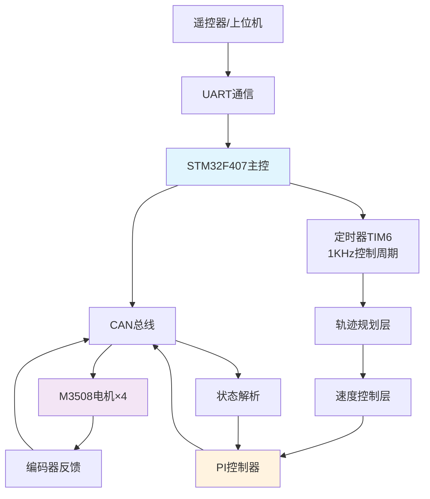
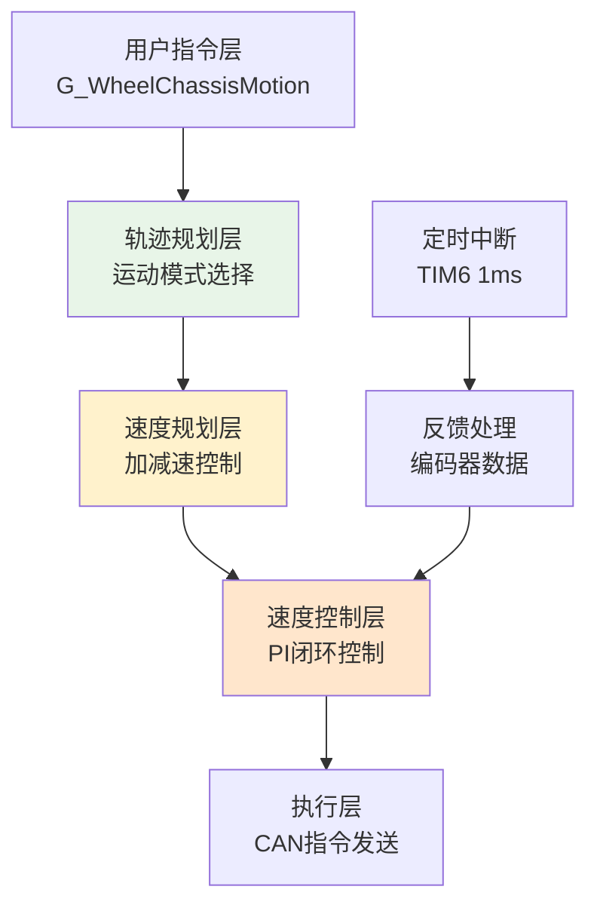

# 🚗 Wheel Chassis Control System

**ROBOCON 2025 全向四轮底盘控制系统**

基于STM32F407的高精度全向移动底盘，采用M3508无刷电机驱动，支持任意方向直线运动和原地旋转。

## 🎯 核心特性

- ✅ **全向运动**: 支持360°任意方向直线运动
- ✅ **原地旋转**: 四轮独立控制，实现灵活转向
- ✅ **高精度控制**: PI闭环控制，1KHz控制频率
- ✅ **实时响应**: CAN总线通信，低延迟反馈
- ✅ **平滑轨迹**: 梯形加减速规划，避免运动冲击
- ✅ **模块化设计**: 清晰的软件架构，易于扩展

## 🏗️ 系统架构



## 📊 运动学模型

### 电机布局（俯视图）
```
     0°(正前方)
  ID2 ————————— ID1
   |             |  
   |   底盘中心   |
   |             |
  ID3 ————————— ID4
   ±180°(正后方)
```

### 运动学解算
系统采用**45度坐标系**进行运动解算：

```mermaid
graph LR
    A[输入指令<br/>v, θ] --> B[坐标变换<br/>45°系统]
    B --> C[速度分解<br/>v1 = v·cos(45°-θ)<br/>v2 = v·sin(45°-θ)]
    C --> D[电机分配<br/>M1=v1, M2=-v2<br/>M3=-v1, M4=v2]
    D --> E[PWM输出]
```

**支持运动模式**：
- 🔄 **直线运动**: 任意角度(-180° ~ +180°)移动
- 🌀 **原地旋转**: 四轮同向，实现转向
- ⏸️ **待机模式**: 安全停止，参数复位

## ⚙️ 控制算法

### 三层控制架构



### PI控制器参数
```c
// 速度环PI控制器
Kp = 1.3    // 比例增益
Ki = 0.14   // 积分增益
Kd = 0      // 微分增益(未使用)

// 物理参数
Acceleration = 0.5    // 加速度 r/s²
Deceleration = 0.5    // 减速度 r/s²
TimeStep = 0.001     // 控制周期 1ms
```

## 🔌 硬件配置

### 主控制器
- **MCU**: STM32F407ZGT6 (168MHz, LQFP144)
- **Flash**: 1MB / **RAM**: 192KB
- **外设**: CAN1, TIM6, GPIO

### 通信接口
- **CAN总线**: 1Mbps, 标准帧
- **调试接口**: SWD (PA13/PA14)
- **扩展接口**: UART×6 (预留遥控器接入)

### 电机配置
- **型号**: DJI M3508 无刷电机
- **减速比**: 3591:187 (约19.2:1)
- **反馈**: 8191线增量编码器
- **通信**: CAN ID 0x201~0x204

## 🚀 快速开始

### 初始化系统  
```c
int main(void) {
    // 系统初始化
    HAL_Init();
    SystemClock_Config();
    MX_GPIO_Init();
    MX_CAN1_Init();
    MX_TIM6_Init();
    
    // 启动底盘控制
    HAL_TIM_Base_Start_IT(&htim6);  // 开启1KHz控制中断
    M3508_Can_Start();              // 启动CAN通信
    
    while(1) {
        // 主循环
    }
}
```

### 4. 控制底盘运动
```c
// 直线运动：向前方右45度移动
G_WheelChassisMotion.state = Linear;
G_WheelChassisMotion.RelativeAngle = 45.0;     // 45度方向
G_WheelChassisMotion.MovementSpeed = 10.0;     // 10r/s速度

// 原地转向：顺时针旋转  
G_WheelChassisMotion.state = Turn;
G_WheelChassisMotion.TurnSpeed = 5.0;          // 5r/s转速

// 停止运动
G_WheelChassisMotion.state = Wait;
```

## 🎮 遥控器接入方案（待定）


## 📡 通信协议

### CAN总线配置
```c
// CAN参数设置
Prescaler = 3          // 预分频器
BS1 = CAN_BS1_9TQ     // 时间段1
BS2 = CAN_BS2_4TQ     // 时间段2  
BaudRate = 1Mbps      // 波特率

// 电机ID映射
0x201 -> Motor1 (右前)
0x202 -> Motor2 (左前)  
0x203 -> Motor3 (左后)
0x204 -> Motor4 (右后)
```

### 数据帧格式
```c
// 发送帧 (0x200)
Byte[0-1]: Motor1电流 (高字节+低字节)
Byte[2-3]: Motor2电流  
Byte[4-5]: Motor3电流
Byte[6-7]: Motor4电流

// 接收帧 (0x201~0x204)  
Byte[0-1]: 转子角度 (0~8191)
Byte[2-3]: 转速 (RPM)
Byte[4-5]: 转矩电流
Byte[6]: 温度
Byte[7]: 保留
```


## 📁 项目结构

```
wheel_chassis/
├── Core/                     # STM32 HAL库核心文件
│   ├── Inc/                 # 核心头文件
│   │   ├── main.h          # 主程序头文件
│   │   ├── can.h           # CAN总线配置
│   │   └── tim.h           # 定时器配置
│   └── Src/                # 核心源文件  
│       ├── main.c          # 主程序入口
│       ├── can.c           # CAN初始化
│       └── tim.c           # 定时器初始化
├── wheel_chassis/           # 应用层代码
│   ├── Inc/                # 应用层头文件
│   │   └── wheelchassis.h  # 底盘控制接口
│   └── Src/                # 应用层源文件
│       └── wheelchassis.c  # 底盘控制实现
├── Drivers/                 # STM32驱动库
├── cmake/                   # CMake配置文件
├── CMakeLists.txt          # 主构建脚本
├── wheel_chassis.ioc       # CubeMX工程文件
└── README.md              # 项目文档
```

## 🔧 高级配置

### 参数调优
```c
// 在wheelchassis.h中修改控制参数
#define Acceleration 0.8      // 提高加速度
#define Deceleration 1.0      // 提高减速度  
#define TimeStep 0.001        // 控制周期

// 在wheelchassis.c中调整PI参数
static double Kp = 1.5;       // 增强响应速度
static double Ki = 0.2;       // 提高稳态精度
```

### 安全保护
```c
// 建议添加的保护机制
#define MAX_SPEED 30.0        // 最大速度限制
#define MAX_CURRENT 15.0      // 最大电流限制
#define TIMEOUT_MS 100        // 通信超时保护

// 电机离线检测
if(motor_offline_count > TIMEOUT_THRESHOLD) {
    G_WheelChassisMotion.state = Wait;  // 进入安全模式
    // 记录错误日志
}
```

## 🛠️ 故障排除

### 常见问题

**1. 电机不转动**
```bash
检查项目:
□ CAN总线连接是否正常
□ 电机ID是否正确(0x201~0x204)  
□ 定时器中断是否开启
□ 电机供电是否正常
```

**2. 运动不平滑**
```bash
解决方案:
□ 调整PI参数(Kp, Ki)
□ 检查加减速参数设置
□ 验证编码器反馈数据
□ 确认控制周期稳定性
```

**3. 方向偏差**
```bash
检查项目:  
□ 电机安装方向是否正确
□ 运动学解算公式检查
□ 编码器零点校准
□ 坐标系定义确认
```

### 调试工具
```c
// 串口调试输出
#ifdef DEBUG_MODE
printf("Motor1: %.2f r/s, Current: %.2f A\n", 
       data[0].speed, Speed_Output[0]);
#endif

// CAN数据监控
// 使用PCAN-View等工具监控CAN总线数据
```

## 👥 开发团队

- **项目负责人**: ROBOCON 2025 电控组
- **算法开发**: 运动控制算法优化
- **硬件集成**: STM32+CAN总线驱动
- **测试验证**: 系统性能测试与优化


