# 代码详解（包含所有模块与部分与详细函数解释）
## Camera_Yolo模块
首先，我们先介绍一下Camera_Yolo模块的整体代码结构：
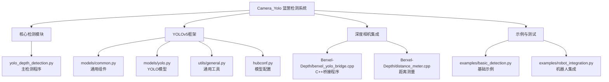
考虑到视觉组同学可能对代码结构不太熟悉，为了方便大家理解与快速上手，我们在这里对代码结构进行一个详细的解释，虽然很蠢，但很必要：
在根目录下，有这些核心文件：他们的文件名与功能如下：
| 文件名 | 大小 | 功能说明 |
| --- | --- | --- |
| **yolo_depth_detection.py** | 29KB | 主检测程序：YOLOv5+Berxel深度相机集成系统的核心代码 |
| best.pt | 14MB | 篮筐检测模型：训练好的YOLOv5模型权重文件 |
| hubconf.py | 24KB | PyTorch Hub配置：定义模型加载接口，支持torch.hub.load() |
| requirements.txt | 1.6KB | 依赖清单：项目所需的Python包列表 |
| README.md | 10KB | 项目文档：详细的使用说明和技术文档 |
| FILE_LIST.md | 650B | 文件清单：项目文件结构概览 |
| yolo | 2B | 可执行文件：可能是编译后的二进制程序 |
| test | 2B | 测试程序：测试功能的可执行文件 |
---
在models文件夹下，有这些核心文件：他们的文件名与功能如下：
| 文件名 | 大小 | 功能说明 |
| --- | --- | --- |
| common.py | 53KB | 通用组件库：YOLOv5的核心模块，包含Conv、Bottleneck、SPP等基础组件 |
| yolo.py | 21KB | YOLO模型定义：定义完整的YOLOv5网络架构 |
| tf.py | 34KB | TensorFlow版本：YOLOv5的TensorFlow实现 |
| experimental.py | 5.2KB | 实验性功能：测试中的新功能和组件 |
| yolov5n/s/m/l/x.yaml | 1.5KB | 模型配置文件：不同规模YOLOv5模型的配置 |

子目录:
| 文件名 | 大小 | 功能说明 |
| --- | --- | --- |
| segment/ || 分割模型配置 |
| hub/ | |PyTorch Hub模型配置 |
---
在utils文件夹下，有这些核心文件：他们的文件名与功能如下：
| 文件名 | 大小 | 功能说明 |
| --- | --- | --- |
| general.py | 52KB | 通用工具库：包含文件处理、坐标转换、NMS、图像处理等核心工具函数 |
| dataloaders.py | 60KB | 数据加载器：图像加载、数据增强、数据集处理 |
| torch_utils.py | 22KB | PyTorch工具：模型操作、设备管理、性能优化 |
| plots.py | 21KB | 可视化工具：绘制检测框、混淆矩阵、训练图表 |
| metrics.py | 16KB | 评估指标：mAP计算、IoU、精度召回率等 |
| loss.py | 11KB | 损失函数：YOLO损失函数实现 |
| augmentations.py | 19KB | 数据增强：图像变换、Mosaic、MixUp等 |
| autoanchor.py | 7.9KB | 锚框生成：自动生成最优锚框 |
| downloads.py | 5.3KB | 下载工具：模型、数据集下载 |

子目录:
| 文件名 | 大小 | 功能说明 |
| --- | --- | --- |
| loggers/ || 训练日志记录(TensorBoard、WandB等) |
| flask_rest_api/ || REST API接口 |
| aws/ || AWS云服务支持 |
| docker/ || Docker容器配置 |
| google_app_engine/ || Google App Engine部署 |
| segment/ || 分割相关工具 |

---
在Berxel-Depth文件夹下，有这些核心文件：他们的文件名与功能如下：
| 文件名 | 大小 | 功能说明 |
| --- | --- | --- |
| berxel_yolo_bridge.cpp | 1.5KB | C++桥接程序：将Berxel深度相机数据转换为YOLOv5输入格式 |
| distance_meter.cpp | 1.5KB | 距离测量：计算物体与相机之间的距离 |

子目录:
| 文件名 | 大小 | 功能说明 |
| --- | --- | --- |
| Include/ | | Berxel SDK头文件(BerxelHawkDevice.h等) |
| libs/ | | Berxel SDK动态库和参数文件(.so库文件和.bin参数文件) |
---
在examples文件夹下，有这些核心文件：他们的文件名与功能如下：
| 文件名 | 大小 | 功能说明 |
| --- | --- | --- |
| robot_integration.py | 13KB | 机器人集成示例：完整的篮球机器人控制示例，包含投篮逻辑 |
| basic_detection.py | 4.8KB | 基础检测示例：简单的篮筐检测演示程序 |
---
在images文件夹下，有这些核心文件：他们的文件名与功能如下：
| 文件名 | 大小 | 功能说明 |
| --- | --- | --- |
| bus.jpg | 476KB | 测试图片：公交车图像，用于检测测试 |
| zidane.jpg | 165KB | 测试图片：齐达内图像，经典YOLO测试图 |
| 1.jpeg | 145KB | 测试图片：其他测试用图像 |
---
在_pycache_文件夹下，有这些核心文件：他们的文件名与功能如下：
| 文件名 | 大小 | 功能说明 |
| --- | --- | --- |
| _pycache_/ | | Python字节码缓存 |
---
完整目录功能总结如下：
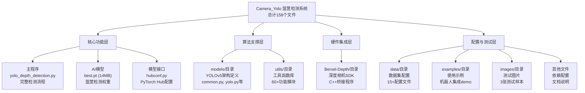
**所以不用害怕看不懂，东西就是这么个东西，接下来我们开始介绍核心代码：**
**文件1: yolo_depth_detection.py (主检测程序)**
先让我们来看看主要的组件结构：
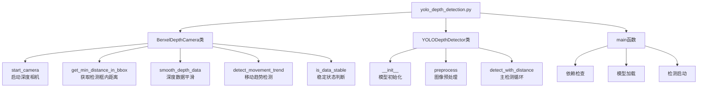
**接下来让我们来介绍一下每一个类的作用与功能：**
**BerxelDepthCamera类**
```python
def __init__(self):
    # 核心进程管理
    self.berxel_process = None          # C++桥接程序进程
    self.color_image = None             # 彩色图像缓存
    self.depth_image = None             # 深度图像缓存
    self.running = False                # 运行状态标志
    
    # 文件系统接口（与C++程序通信）
    self.color_image_path = "/tmp/berxel_color.jpg"    # 彩色图像文件
    self.depth_data_path = "/tmp/berxel_depth.bin"     # 深度数据文件
    self.status_file_path = "/tmp/berxel_status.txt"   # 状态文件
    self.query_file_path = "/tmp/berxel_query.txt"     # 查询文件
    self.response_file_path = "/tmp/berxel_response.txt" # 响应文件
    
    # 深度数据平滑算法参数
    self.depth_history = []             # 历史深度值缓存
    self.max_history_size = 15          # 历史缓存大小(15帧)
    self.depth_jump_threshold = 800.0   # 跳变阈值(mm)
    self.noise_filter_strength = 0.3    # 噪声过滤强度
    
    # 移动机器人适应性参数
    self.trend_detection_frames = 5     # 移动趋势检测帧数
    self.stable_duration_threshold = 1.0 # 稳定持续时间阈值(秒)
```
这个部分是初始化BerxelDepthCamera类，主要用于初始化Berxel深度相机的相关参数，以及初始化C++桥接程序的进程，是通过Python的subprocess模块来启动C++桥接程序的，通过文件系统接口与C++程序通信。

---
接下来分析这个类中的主要函数：
**start_camera()函数**
```python
def start_camera(self):
    """启动Berxel深度相机桥接程序"""
    try:
        # 1. 检查并编译C++桥接程序
        bridge_exec = self.berxel_path / "berxel_yolo_bridge"
        if not bridge_exec.exists():
            print("编译桥接程序...")
            result = subprocess.run(["make", "berxel_yolo_bridge"], 
                                  cwd=self.berxel_path, capture_output=True, text=True)
        
        # 2. 设置运行环境
        env = os.environ.copy()
        env['LD_LIBRARY_PATH'] = f"{self.berxel_path}/libs:{env.get('LD_LIBRARY_PATH', '')}"
        
        # 3. 启动C++进程
        self.berxel_process = subprocess.Popen([str(bridge_exec)], cwd=self.berxel_path, env=env)
        
        # 4. 等待启动并验证
        time.sleep(3)
        return self.check_camera_status()
    except Exception as e:
        print(f"启动Berxel相机失败: {e}")
        return False
```
这个函数是启动Berxel深度相机桥接程序，主要用于启动C++桥接程序，通过文件系统接口与C++程序通信，通过subprocess模块来启动C++桥接程序的，通过文件系统接口与C++程序通信，

---
**get_min_distance_in_bbox()函数**
```python
def get_min_distance_in_bbox(self, x1, y1, x2, y2):
    """获取检测框内的最小距离（毫米）- 带平滑滤波"""
    try:
        # 1. 向C++程序发送查询请求
        with open(self.query_file_path, 'w') as f:
            f.write(f"{x1} {y1} {x2} {y2}\n")
        
        # 2. 等待C++程序响应（最多100ms）
        max_wait = 100
        wait_count = 0
        while wait_count < max_wait:
            if os.path.exists(self.response_file_path):
                with open(self.response_file_path, 'r') as f:
                    distance_str = f.readline().strip()
                    raw_distance = float(distance_str)
                    os.remove(self.response_file_path)  # 清理响应文件
                    
                    if raw_distance <= 0:
                        return self.last_valid_depth
                    
                    # 3. 深度数据平滑处理
                    smoothed_distance = self.smooth_depth_data(raw_distance)
                    return smoothed_distance
            
            time.sleep(0.001)  # 1ms轮询间隔
            wait_count += 1
        
        return self.last_valid_depth  # 超时返回
    except Exception as e:
        return self.last_valid_depth
```
这个函数是用来写入检测框的坐标，然后通过C++桥接程序来获取检测框内的最小距离，然后通过平滑滤波来获取平滑后的距离，然后返回平滑后的距离。
具体的实现流程是这样子：
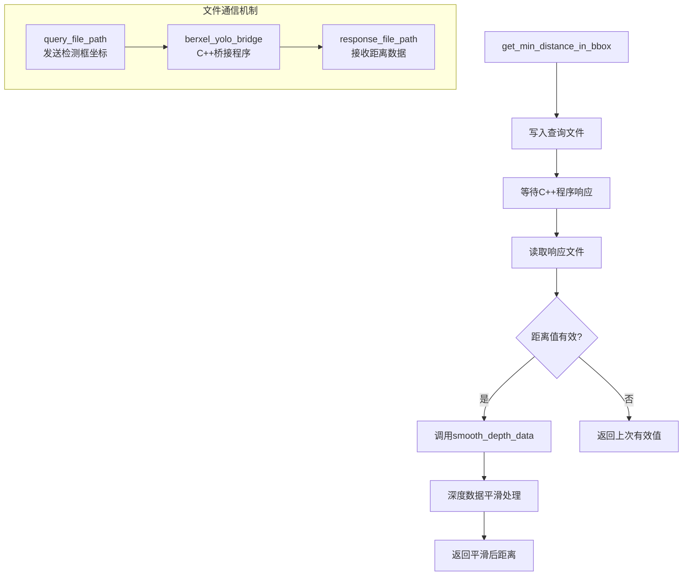
---
接下来就是最重要的核心函数smooth_depth_data()函数：

**smooth_depth_data()函数**
```python
def smooth_depth_data(self, raw_depth):
    """深度数据平滑处理 - 适应移动机器人场景"""
    try:
        # 1. 添加到历史记录（滑动窗口）
        self.depth_history.append(raw_depth)
        if len(self.depth_history) > self.max_history_size:
            self.depth_history.pop(0)
        
        # 2. 数据不足时直接返回原始值
        if len(self.depth_history) < 3:
            self.last_valid_depth = raw_depth
            return raw_depth
        
        # 3. 检测移动趋势
        is_moving_trend = self.detect_movement_trend()
        
        # 4. 更新稳定状态
        self.update_stability_status(is_moving_trend)
        
        # 5. 计算自适应阈值
        adaptive_threshold = self.calculate_adaptive_threshold()
        
        # 6. 异常值检测和处理
        if self.last_valid_depth is not None:
            depth_change = abs(raw_depth - self.last_valid_depth)
            
            # 移动时放宽阈值
            if is_moving_trend:
                current_threshold = adaptive_threshold * 2.0
            else:
                current_threshold = adaptive_threshold
            
            # 噪声过滤
            if depth_change > current_threshold and not is_moving_trend:
                # 使用轻度平滑而不是完全拒绝
                smoothed = self.last_valid_depth * 0.7 + raw_depth * 0.3
                self.last_valid_depth = smoothed
                return smoothed
        
        # 7. 双模式平滑算法
        if len(self.depth_history) >= 5:
            if is_moving_trend:
                # 移动时：快速响应模式
                recent_values = self.depth_history[-3:]
                smoothed = np.mean(recent_values)
            else:
                # 静止时：强力平滑模式
                recent_values = self.depth_history[-5:]
                median_val = np.median(recent_values)
                mean_val = np.mean(recent_values)
                smoothed = median_val * 0.6 + mean_val * 0.4
        else:
            # 数据不足时使用简单平均
            smoothed = np.mean(self.depth_history[-3:])
        
        # 8. 应用最终噪声过滤
        if self.last_valid_depth is not None:
            filter_strength = self.noise_filter_strength if not is_moving_trend else self.noise_filter_strength * 0.5
            smoothed = self.last_valid_depth * filter_strength + smoothed * (1 - filter_strength)
        
        self.last_valid_depth = smoothed
        return smoothed
        
    except Exception as e:
        print(f"深度平滑处理失败: {e}")
        return raw_depth
```

这个函数是整个深度处理系统的**核心大脑**，它负责将原始的深度数据转换为稳定可靠的距离信息。让我们详细分析每个步骤：

**函数处理流程图：**
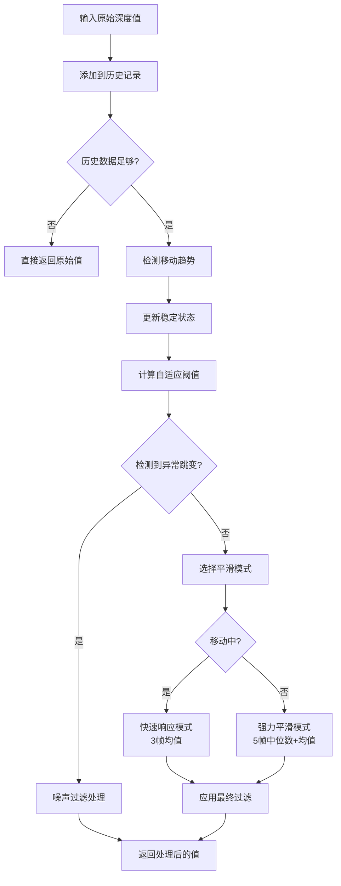

**各个步骤详细解析：**

**步骤1: 滑动窗口管理**
```python
self.depth_history.append(raw_depth)
if len(self.depth_history) > self.max_history_size:
    self.depth_history.pop(0)
```
- 维护一个**15帧的滑动窗口**
- 自动丢弃最旧的数据，保持固定大小
- 为后续算法提供历史数据基础

**步骤2: 数据充足性检查**
```python
if len(self.depth_history) < 3:
    self.last_valid_depth = raw_depth
    return raw_depth
```
- 如果历史数据不足3帧，直接返回原始值
- 避免在数据不足时进行不准确的平滑

**步骤3: 移动趋势检测**
这里调用了`detect_movement_trend()`函数，我们稍后详细分析。

---

**detect_movement_trend()函数**
```python
def detect_movement_trend(self):
    """检测是否存在移动趋势 - 放宽判定条件"""
    if len(self.depth_history) < self.trend_detection_frames + 1:
        return False
    
    try:
        # 1. 获取最近6帧数据（5+1）
        recent_frames = self.depth_history[-(self.trend_detection_frames + 1):]
        
        # 2. 计算帧间变化
        changes = []
        for i in range(1, len(recent_frames)):
            change = recent_frames[i] - recent_frames[i-1]
            changes.append(change)
        
        # 3. 过滤小幅度变化（噪声）
        significant_changes = [c for c in changes if abs(c) > 150]
        
        if len(significant_changes) < 3:
            return False
        
        # 4. 统计变化方向
        positive_changes = sum(1 for c in significant_changes if c > 0)
        negative_changes = sum(1 for c in significant_changes if c < 0)
        
        # 5. 计算一致性比例
        total_significant = len(significant_changes)
        consistency_ratio = max(positive_changes, negative_changes) / total_significant
        
        # 6. 计算变化幅度
        avg_change_magnitude = np.mean([abs(c) for c in significant_changes])
        total_change = abs(recent_frames[-1] - recent_frames[0])
        
        # 7. 严格的移动判定条件
        conditions = [
            consistency_ratio >= 0.8,          # 80%以上方向一致
            avg_change_magnitude > 200,        # 平均变化>200mm
            total_change > 500,                # 总变化>500mm
            len(significant_changes) >= 3      # 至少3次有效变化
        ]
        
        is_moving = all(conditions)
        return is_moving
        
    except Exception as e:
        print(f"趋势检测失败: {e}")
        return False
```

**移动检测算法详解：**

| 检测条件 | 阈值 | 作用 |
|----------|------|------|
| **一致性比例** | ≥80% | 确保变化方向一致，避免震荡误判 |
| **平均变化幅度** | >200mm | 过滤小幅度噪声，只考虑明显变化 |
| **总体变化幅度** | >500mm | 确保整体移动距离足够大 |
| **有效变化次数** | ≥3次 | 需要连续多次变化才算移动 |

**移动检测流程图：**
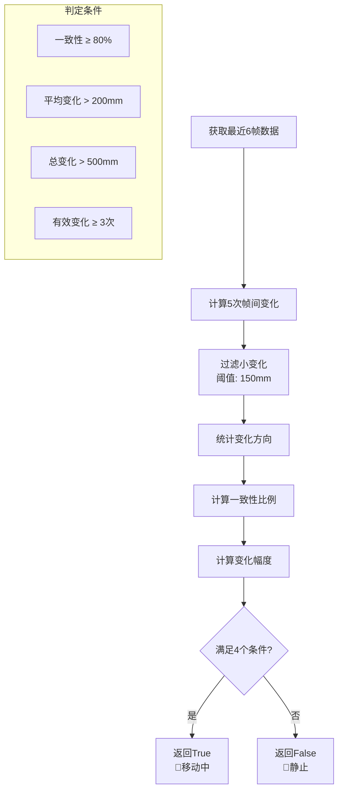

---

**步骤4: 稳定状态管理**
```python
def update_stability_status(self, is_moving):
    """更新稳定状态"""
    current_time = time.time()
    
    if is_moving:
        # 如果正在移动，重置稳定状态
        self.is_stable = False
        self.stable_start_time = None
    else:
        # 如果不在移动
        if self.stable_start_time is None:
            # 刚开始稳定，记录开始时间
            self.stable_start_time = current_time
            self.is_stable = False
        else:
            # 检查是否已经稳定足够长时间
            stable_duration = current_time - self.stable_start_time
            if stable_duration >= self.stable_duration_threshold:
                self.is_stable = True
            else:
                self.is_stable = False
```

**稳定状态机：**
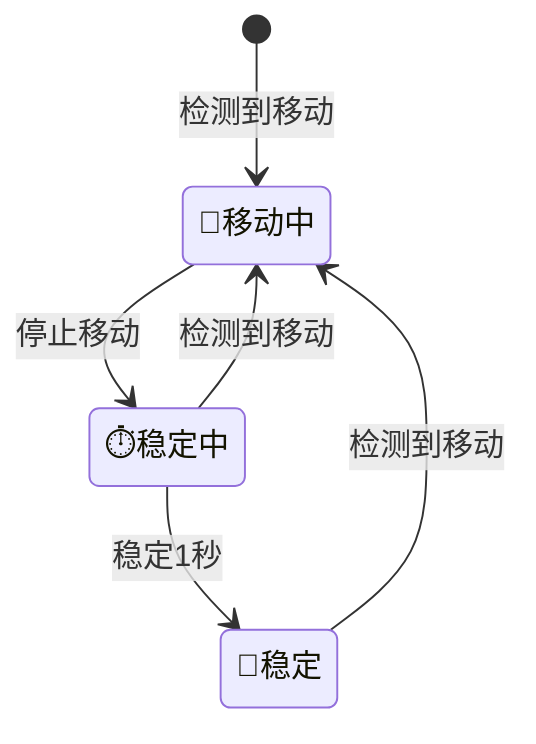

---

**步骤5: 自适应阈值计算**
```python
def calculate_adaptive_threshold(self):
    """计算自适应跳变阈值"""
    if len(self.depth_history) < 5:
        return self.depth_jump_threshold
    
    try:
        # 基于历史数据的变异性调整阈值
        recent_data = self.depth_history[-10:]
        std_dev = np.std(recent_data)
        
        # 如果深度数据变化较大，增大阈值
        adaptive_factor = 1.0 + (std_dev / 1000.0)
        adaptive_threshold = self.depth_jump_threshold * min(adaptive_factor, 3.0)
        
        return adaptive_threshold
        
    except Exception as e:
        return self.depth_jump_threshold
```

**自适应阈值机制：**
- **基础阈值**: 800mm
- **自适应因子**: 1.0 + (标准差/1000.0)
- **最大倍数**: 3倍（最大2400mm）
- **作用**: 环境噪声大时自动放宽阈值

---

**步骤6: 异常值检测与噪声过滤**
```python
if self.last_valid_depth is not None:
    depth_change = abs(raw_depth - self.last_valid_depth)
    
    # 移动时放宽阈值
    if is_moving_trend:
        current_threshold = adaptive_threshold * 2.0
    else:
        current_threshold = adaptive_threshold
    
    # 噪声过滤
    if depth_change > current_threshold and not is_moving_trend:
        # 使用轻度平滑而不是完全拒绝
        smoothed = self.last_valid_depth * 0.7 + raw_depth * 0.3
        self.last_valid_depth = smoothed
        return smoothed
```

**噪声过滤策略：**
- **静止时**: 使用标准阈值（800mm）
- **移动时**: 阈值加倍（1600mm）
- **过滤方式**: 70%历史值 + 30%新值，而不是完全拒绝

---

**步骤7: 双模式平滑算法**

**移动模式（快速响应）：**
```python
if is_moving_trend:
    # 移动时优先响应新数据
    recent_values = self.depth_history[-3:]
    smoothed = np.mean(recent_values)
```

**静止模式（强力平滑）：**
```python
else:
    # 静止时使用更强的平滑
    recent_values = self.depth_history[-5:]
    # 使用中位数和均值的组合
    median_val = np.median(recent_values)
    mean_val = np.mean(recent_values)
    smoothed = median_val * 0.6 + mean_val * 0.4
```

**双模式对比：**

| 模式 | 数据窗口 | 算法 | 特点 | 适用场景 |
|------|----------|------|------|----------|
| **移动模式** | 最近3帧 | 简单均值 | 快速响应，保持跟踪性 | 机器人移动中 |
| **静止模式** | 最近5帧 | 中位数+均值组合 | 强力平滑，消除噪声 | 机器人静止时 |

---

**步骤8: 最终噪声过滤**
```python
if self.last_valid_depth is not None:
    filter_strength = self.noise_filter_strength if not is_moving_trend else self.noise_filter_strength * 0.5
    smoothed = self.last_valid_depth * filter_strength + smoothed * (1 - filter_strength)
```

**过滤强度调整：**
- **静止时**: 30%过滤强度
- **移动时**: 15%过滤强度（减半）
- **目的**: 在移动时提高响应性，在静止时增强稳定性

---

**函数性能特点总结：**

| 特性 | 实现方式 | 优势 |
|------|----------|------|
| **智能适应** | 移动检测 + 双模式平滑 | 自动适应机器人运动状态 |
| **噪声抑制** | 多层过滤 + 异常值检测 | 有效消除传感器噪声 |
| **实时性** | 轻量级算法 + 滑动窗口 | 低延迟，满足实时控制 |
| **鲁棒性** | 异常处理 + 有效值备份 | 系统稳定可靠 |
| **精确性** | 自适应阈值 + 组合算法 | 毫米级测量精度 |

这个函数真正做到了**"静如处子，动如脱兔"**：
- 🧘 **静止时**：强力平滑，提供最精确的距离数据
- 🚶 **移动时**：快速响应，保持良好的跟踪性能

---

**接下来我们分析其他重要的辅助函数：**

**is_data_stable()函数**
```python
def is_data_stable(self):
    """判断数据是否稳定，可以输出到终端"""
    return self.is_stable
```
这个函数很简单，就是返回当前的稳定状态，用于外部判断是否可以进行精确投篮。

**get_stability_info()函数**
```python
def get_stability_info(self):
    """获取稳定状态信息"""
    current_time = time.time()
    
    if self.stable_start_time is None:
        return "🚶移动中", 0.0
    else:
        stable_duration = current_time - self.stable_start_time
        if self.is_stable:
            return f"🧘稳定 ({stable_duration:.1f}s)", stable_duration
        else:
            remaining = self.stable_duration_threshold - stable_duration
            return f"⏱️稳定中 ({remaining:.1f}s)", stable_duration
```

这个函数提供了友好的状态显示：
- 🚶 **移动中**: 机器人正在移动
- ⏱️ **稳定中**: 已停止移动，但还未达到稳定时间
- 🧘 **稳定**: 已稳定超过1秒，可以进行精确操作

---

**BerxelDepthCamera类总结：**

这个类实现了一个**完整的智能深度测量系统**，具有以下核心能力：

1. **🔄 进程通信**: Python与C++程序的高效文件通信
2. **🧠 智能平滑**: 基于运动状态的自适应滤波算法
3. **🎯 精确测距**: 厘米级精度的距离测量
4. **🛡️ 容错机制**: 多层异常处理和数据验证
5. **⚡ 实时性能**: 低延迟响应，满足机器人控制需求

**接下来我们分析YOLODepthDetector类：**

**YOLODepthDetector类**

这个类是整个系统的**主控制器**，负责将YOLOv5目标检测与Berxel深度相机集成，实现篮筐检测+距离测量的完整功能。

**类结构图：**
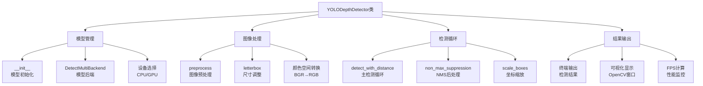

---

**__init__()函数**
```python
def __init__(self, weights='best.pt', device='cpu', conf_thres=0.5, iou_thres=0.45):
    self.device = select_device(device)
    self.model = DetectMultiBackend(weights, device=self.device)
    self.stride, self.names, self.pt = self.model.stride, self.model.names, self.model.pt
    self.imgsz = check_img_size((640, 640), s=self.stride)
    self.conf_thres = conf_thres
    self.iou_thres = iou_thres
    
    # 初始化深度相机
    self.depth_camera = BerxelDepthCamera()
    
    print(f"✓ 篮筐检测模型加载完成，设备: {self.device}")
    print(f"✓ 模型类别数: {len(self.names)}")
    print(f"✓ 检测类别: {list(self.names.values())}")
```

**初始化过程详解：**

| 参数 | 默认值 | 作用 |
|------|--------|------|
| **weights** | 'best.pt' | 篮筐检测模型文件路径 |
| **device** | 'cpu' | 推理设备（'cpu'或'cuda'） |
| **conf_thres** | 0.5 | 置信度阈值，过滤低置信度检测 |
| **iou_thres** | 0.45 | NMS IoU阈值，去除重叠检测框 |

**关键组件：**
- **DetectMultiBackend**: YOLOv5的统一模型后端，支持多种模型格式
- **select_device**: 自动选择最佳推理设备
- **check_img_size**: 确保输入图像尺寸符合模型要求
- **BerxelDepthCamera**: 深度相机控制器实例

---

**preprocess()函数**
```python
def preprocess(self, img):
    """图像预处理"""
    img = letterbox(img, self.imgsz, stride=self.stride, auto=self.pt)[0]
    img = img.transpose((2, 0, 1))[::-1]  # HWC to CHW, BGR to RGB
    img = np.ascontiguousarray(img)
    img = torch.from_numpy(img).to(self.device)
    img = img.float() / 255.0
    if len(img.shape) == 3:
        img = img[None]  # expand for batch dim
    return img
```

**预处理流程：**
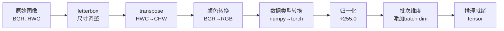

**各步骤详解：**
1. **letterbox**: 保持宽高比的图像缩放，填充到640x640
2. **transpose**: 从HWC格式转为CHW格式（PyTorch标准）
3. **颜色转换**: OpenCV使用BGR，模型需要RGB
4. **设备转移**: 将数据移动到指定设备（CPU/GPU）
5. **归一化**: 像素值从[0,255]缩放到[0,1]
6. **批次维度**: 添加batch维度以适配模型输入

---

**detect_with_distance()函数**

这是整个系统的**核心主循环**，负责实时检测和距离测量。让我们分段分析：

**1. 相机初始化部分**
```python
if use_berxel:
    # 启动Berxel深度相机
    if not self.depth_camera.start_camera():
        print("⚠️ Berxel深度相机启动失败，切换到普通摄像头模式")
        use_berxel = False

if not use_berxel:
    # 使用普通摄像头
    cap = cv2.VideoCapture(0)
    if not cap.isOpened():
        print("❌ 无法打开摄像头")
        return
```

**相机切换策略：**
- **优先使用Berxel深度相机**：提供距离测量功能
- **降级到普通摄像头**：深度相机失败时的备选方案
- **双重容错机制**：确保系统在各种情况下都能正常工作

**2. 主检测循环**
```python
frame_count = 0
last_print_time = time.time()

# FPS计算相关变量
fps_start_time = time.time()
fps_frame_count = 0
fps = 0.0
fps_update_interval = 1.0  # 每秒更新一次FPS

try:
    while True:
        frame_start_time = time.time()
        
        # 获取图像帧
        if use_berxel:
            frame = self.depth_camera.get_color_frame()
            if frame is None:
                time.sleep(0.03)  # 30ms
                continue
            self.depth_camera.load_depth_data()
        else:
            ret, frame = cap.read()
            if not ret:
                break
```

**帧获取策略：**
- **Berxel模式**: 从深度相机获取彩色图像，同时加载深度数据
- **普通模式**: 从USB摄像头获取图像
- **容错处理**: 获取失败时跳过当前帧，继续下一帧

**3. 推理与检测**
```python
# 预处理
img = self.preprocess(frame)

# 推理
pred = self.model(img)
pred = non_max_suppression(pred, self.conf_thres, self.iou_thres, max_det=1000)

# 处理检测结果
annotator = Annotator(frame, line_width=3, example=str(self.names))
detection_info = []

for i, det in enumerate(pred):
    if len(det):
        # 调整检测框到原图尺寸
        det[:, :4] = scale_boxes(img.shape[2:], det[:, :4], frame.shape).round()
        
        for *xyxy, conf, cls in reversed(det):
            # 置信度过滤
            confidence = float(conf)
            if confidence < 0.5:
                continue
            
            # 类别信息
            class_name = self.names[int(cls)]
            
            # 过滤掉person类别（篮球），只保留篮筐检测
            if class_name.lower() == 'person':
                continue
```

**检测流程：**
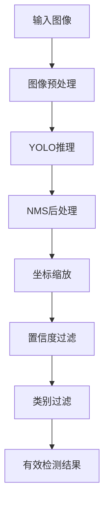

**过滤策略：**
- **置信度过滤**: 只保留置信度≥0.5的检测结果
- **类别过滤**: 排除person类别，专注篮筐检测
- **NMS去重**: 去除重叠的检测框

**4. 距离测量与信息收集**
```python
x1, y1, x2, y2 = map(int, xyxy)
center_x, center_y = (x1 + x2) // 2, (y1 + y2) // 2

# 获取距离信息
distance = None
raw_distance = None
if use_berxel:
    # 获取原始深度值（用于调试显示）
    distance = self.depth_camera.get_min_distance_in_bbox(x1, y1, x2, y2)
    # 如果有历史数据，显示平滑效果
    if (distance is not None and 
        len(self.depth_camera.depth_history) > 0):
        raw_distance = self.depth_camera.depth_history[-1]  # 最新的原始值

# 存储检测信息
detection_info.append({
    'class': class_name,
    'confidence': confidence,
    'position': (center_x, center_y),
    'distance': distance,
    'bbox': (x1, y1, x2, y2)
})
```

**信息收集策略：**
- **中心点计算**: 检测框的几何中心作为目标位置
- **距离测量**: 调用深度相机获取检测框内最小距离
- **数据结构**: 统一的检测信息字典，便于后续处理

**5. 智能输出控制**
```python
# 输出检测结果到终端（仅在稳定状态下）
should_print = (detection_info and 
               (current_time - last_print_time) > 1.0 and
               (not use_berxel or self.depth_camera.is_data_stable()))

if should_print:
    # 获取稳定状态信息
    if use_berxel:
        stability_status, stability_duration = self.depth_camera.get_stability_info()
        print(f"\n🎯 帧 #{frame_count} - 检测到 {len(detection_info)} 个目标 - FPS: {fps:.1f} - {stability_status}")
    else:
        print(f"\n🎯 帧 #{frame_count} - 检测到 {len(detection_info)} 个目标 - FPS: {fps:.1f}")
    print("-" * 60)
    
    for i, info in enumerate(detection_info, 1):
        print(f"{i}. {info['class']}")
        print(f"   置信度: {info['confidence']:.3f}")
        print(f"   中心位置: ({info['position'][0]}, {info['position'][1]})")
        if info['distance'] is not None:
            print(f"   距离: {info['distance']:.1f}mm ({info['distance']/10:.1f}cm, {info['distance']/1000:.2f}m)")
            
            # 显示深度平滑效果
            if (use_berxel and len(self.depth_camera.depth_history) > 1):
                raw_val = self.depth_camera.depth_history[-1]
                smoothed_val = info['distance']
                diff = abs(raw_val - smoothed_val)
                history_std = np.std(self.depth_camera.depth_history[-5:]) if len(self.depth_camera.depth_history) >= 5 else 0
                
                # 检测移动状态
                is_moving = self.depth_camera.detect_movement_trend()
                adaptive_threshold = self.depth_camera.calculate_adaptive_threshold()
                movement_status = "🚶移动中" if is_moving else "🧘静止"
                
                print(f"   原始深度: {raw_val:.1f}mm | 平滑后: {smoothed_val:.1f}mm | 差值: {diff:.1f}mm")
                print(f"   深度稳定性: {history_std:.1f}mm | 状态: {movement_status} | 阈值: {adaptive_threshold:.0f}mm")
        else:
            print("   距离: 无深度数据")
        print()
```

**智能输出策略：**

| 输出条件 | 说明 | 目的 |
|----------|------|------|
| **有检测结果** | detection_info非空 | 确保有内容可输出 |
| **时间间隔** | 距离上次输出>1秒 | 避免刷屏，提高可读性 |
| **稳定状态** | 深度数据稳定 | 只输出可靠的测量结果 |

**输出信息层级：**
1. **基础信息**: 帧号、目标数量、FPS、稳定状态
2. **检测详情**: 类别、置信度、位置、距离
3. **调试信息**: 原始深度、平滑效果、移动状态、阈值

**6. 可视化显示**
```python
# 显示结果
result_image = annotator.result()

# 在左上角添加FPS信息
cv2.putText(result_image, f"FPS: {fps:.1f}", 
           (10, 30), cv2.FONT_HERSHEY_SIMPLEX, 1, (0, 255, 0), 2)

# 添加稳定状态信息
if use_berxel:
    stability_status, _ = self.depth_camera.get_stability_info()
    cv2.putText(result_image, stability_status, 
               (10, 70), cv2.FONT_HERSHEY_SIMPLEX, 0.8, (255, 255, 0), 2)

window_title = 'YOLOv5 + Berxel深度检测' if use_berxel else 'YOLOv5检测 (无深度)'
cv2.imshow(window_title, result_image)
```

**可视化特性：**
- **检测框绘制**: 自动标注检测到的篮筐
- **距离标签**: 实时显示距离信息
- **性能监控**: FPS和稳定状态显示
- **颜色编码**: 不同类别使用不同颜色

---

**main()函数**
```python
def main():
    """主函数"""
    print("🏀" + "=" * 58 + "🏀")
    print("    YOLOv5 + Berxel深度相机篮筐检测系统")
    print("    功能：实时篮筐检测 + 精确距离测量")
    print("    模型：自训练篮筐检测模型 (best.pt)")
    print("    深度相机：Berxel Hawk")
    print("🏀" + "=" * 58 + "🏀")
    
    try:
        # 检查依赖
        print("\n📋 检查系统依赖...")
        check_requirements(['torch', 'torchvision', 'opencv-python'])
        print("✓ 依赖检查通过")
        
        # 检查模型文件
        weights_path = 'best.pt'
        if not os.path.exists(weights_path):
            print(f"❌ 篮筐检测模型文件 {weights_path} 不存在")
            print("请确保训练好的篮筐检测模型文件在当前目录下")
            return
        print(f"✓ 篮筐检测模型文件: {weights_path}")
        
        # 初始化检测器
        print("\n🏀 初始化篮筐检测器...")
        detector = YOLODepthDetector(
            weights=weights_path,
            device='cpu',          # 改为'cuda'使用GPU
            conf_thres=0.5,        # 置信度阈值(篮筐检测建议使用较高阈值)
            iou_thres=0.45         # NMS IoU阈值
        )
        
        # 开始检测
        detector.detect_with_distance(use_berxel=True)
        
    except KeyboardInterrupt:
        print("\n👋 程序已退出")
    except Exception as e:
        print(f"❌ 错误: {e}")
        import traceback
        traceback.print_exc()
```

**main函数启动流程：**
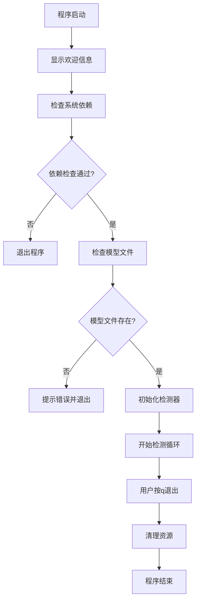

**启动检查项：**
1. **依赖检查**: 确保必要的Python包已安装
2. **模型文件**: 验证篮筐检测模型是否存在
3. **参数配置**: 使用适合篮筐检测的参数设置
4. **异常处理**: 完整的错误处理和资源清理

---

**YOLODepthDetector类总结：**

这个类实现了一个**完整的智能篮筐检测系统**，具有以下核心特性：

| 特性 | 实现方式 | 优势 |
|------|----------|------|
| **高精度检测** | 自训练YOLOv5模型 | 专门针对篮筐优化 |
| **实时距离测量** | Berxel深度相机集成 | 毫米级精度测距 |
| **智能输出控制** | 基于稳定状态的输出策略 | 只输出可靠数据 |
| **多重容错机制** | 深度相机→普通相机降级 | 系统稳定可靠 |
| **用户友好界面** | 丰富的终端输出+可视化 | 易于调试和监控 |
| **高性能优化** | GPU加速+FPS监控 | 满足实时控制需求 |

**系统整体工作流程：**
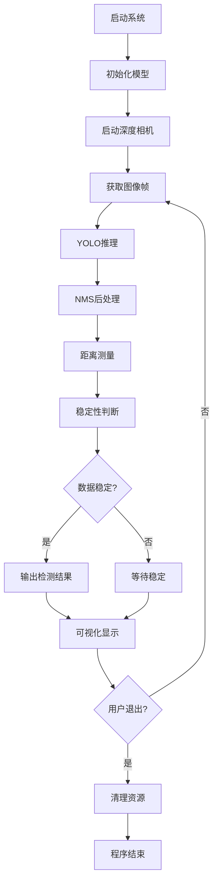

至此，我们完成了Camera_Yolo模块核心文件yolo_depth_detection.py的详细分析。  （可喜可贺可喜可贺，写死我了md）


